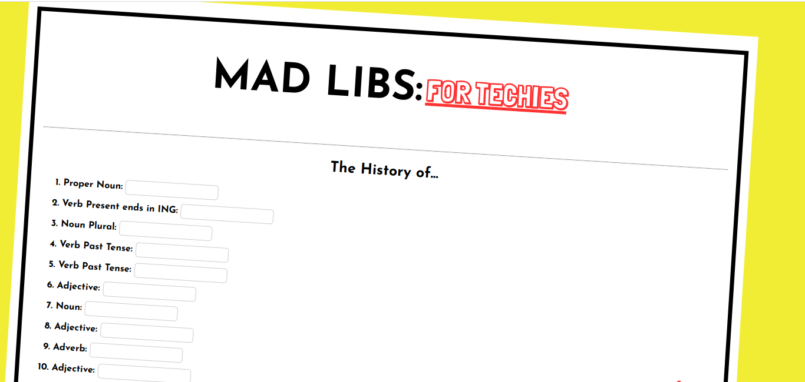
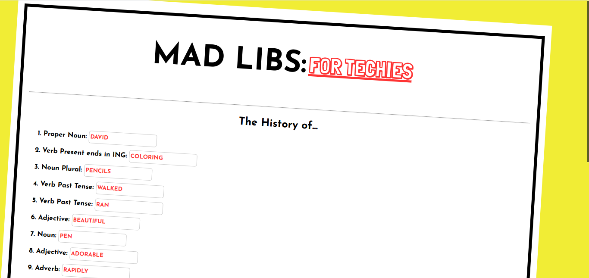
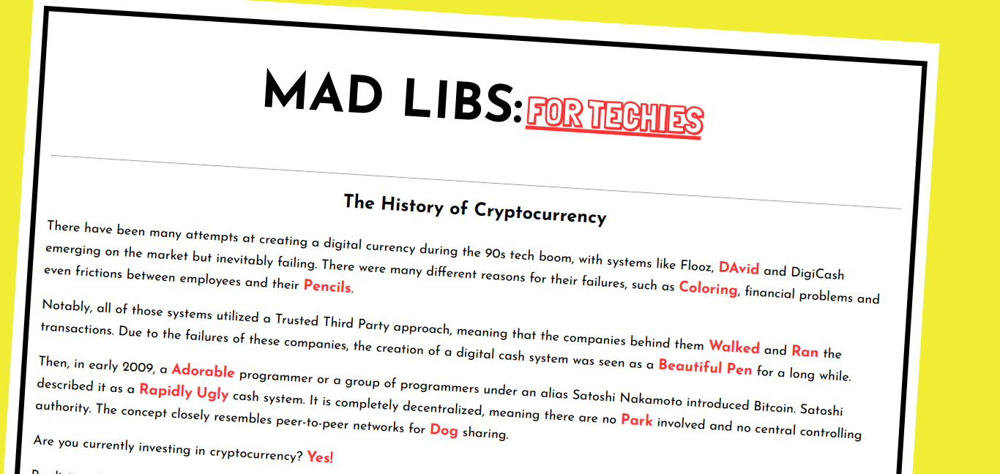

# Mad Lib for Techies

## Premise

Forms are great for collecting information on users, like job applications or insightful surveys. However, we can also stretch our creative muscles and have a little fun with forms. For this project, we’ll use our knowledge of the HTML form and grab user input to put a spin on a classic story!

What you have to do is now make a form capable of collecting the correct information so that the newly crafted story makes sense!

## Code Explanation

### HTML
This project attempts to simulate a mad lib game. The project begins with the creation of html form with 17 inputs. Each input is required. Upon form completion and submission, a query string is created. 

### JS Script
A URLSearchParams object is created, which grabs the parameters from the query string found in the URL. Variables are hardcoded and assigned to represent the value of each parameter. Through string interpolation, the values are inserted into the story template. DOM-manipulation is used to present the completed mad lib to the user. 

### Current Version

#### Mad Lib Form - Empty

#### Mad Lib Form - Filled

#### Completed Mad Lib Story

#### Original Story - No User Submissions

